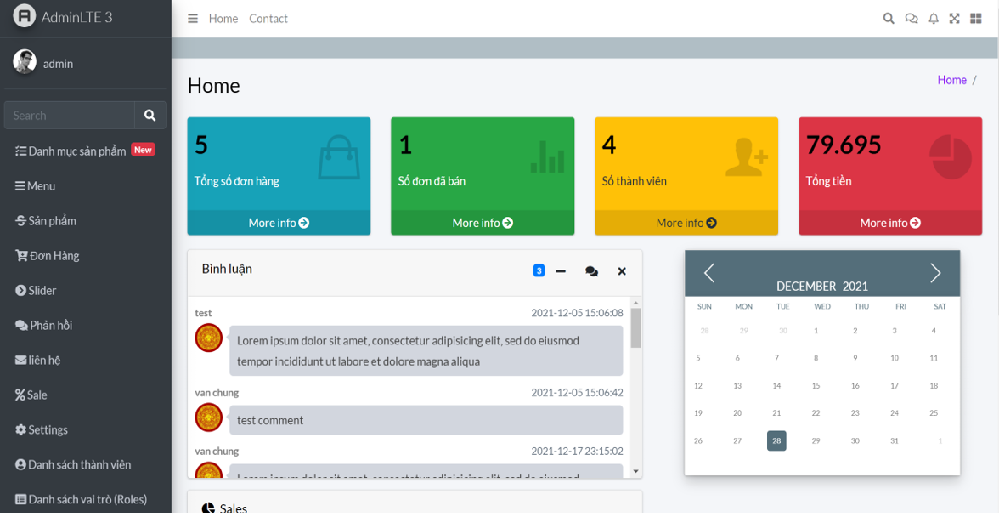
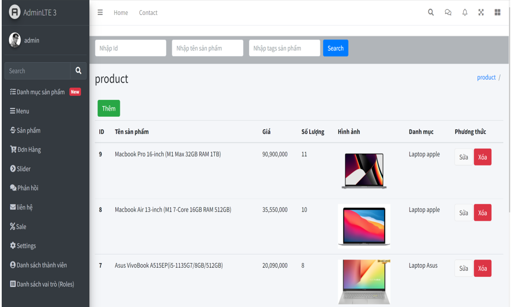
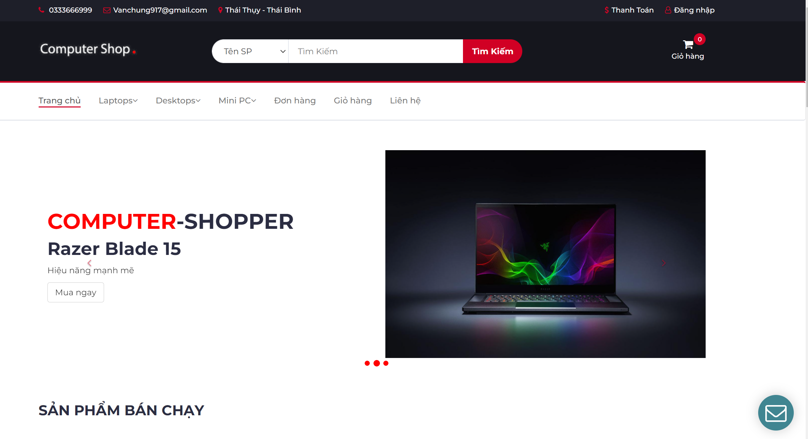
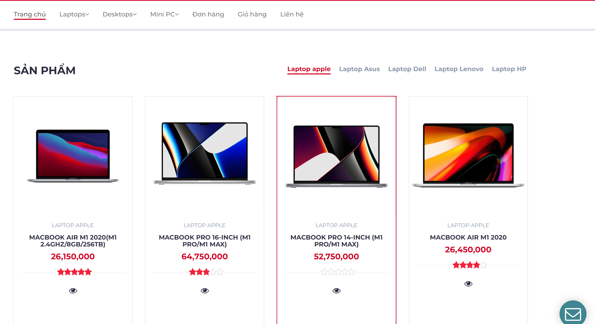
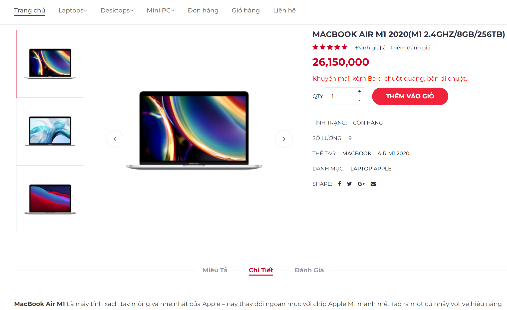
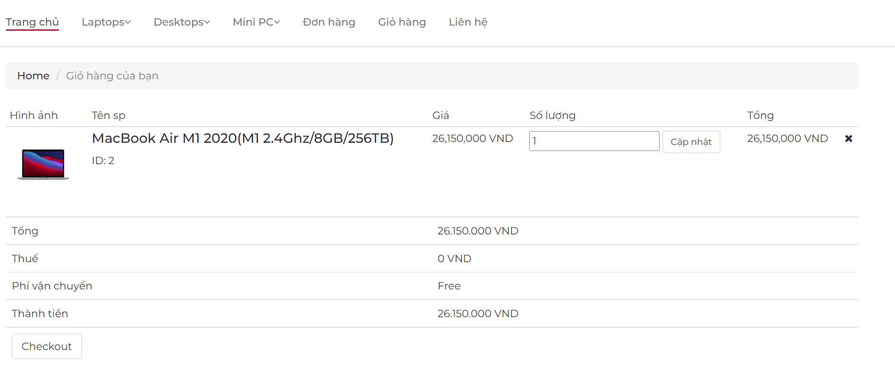
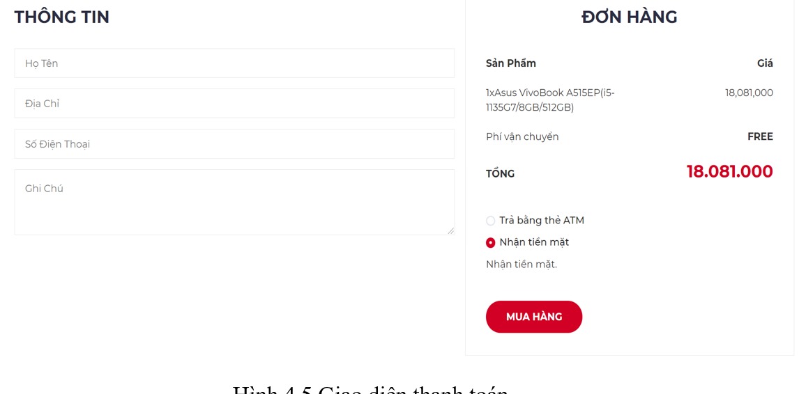

# shop_laravel
Installation
+ This package requires PHP 7+

+ Install composer

+ install database

+ run php artisan serve

+ Open http://localhost/admin/ in browser,use username admin and password admin to login.

+ Open http://localhost/ in browser , to login user.

- Middleware

